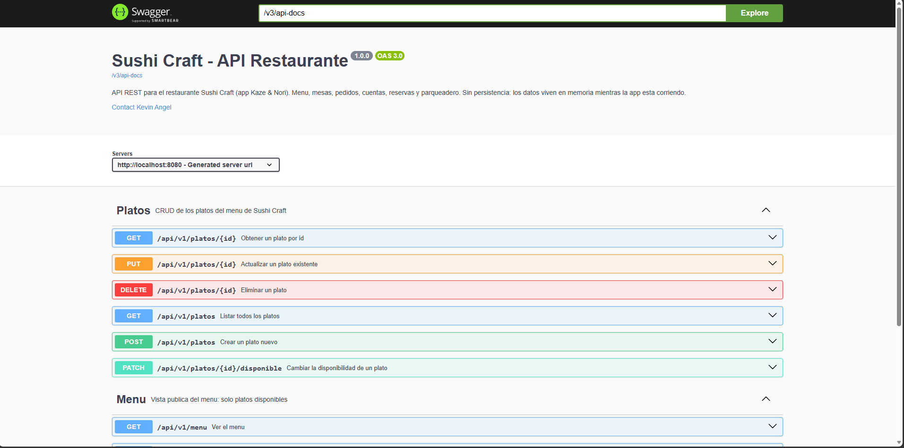
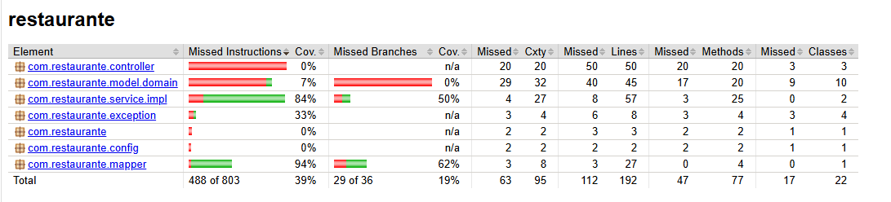
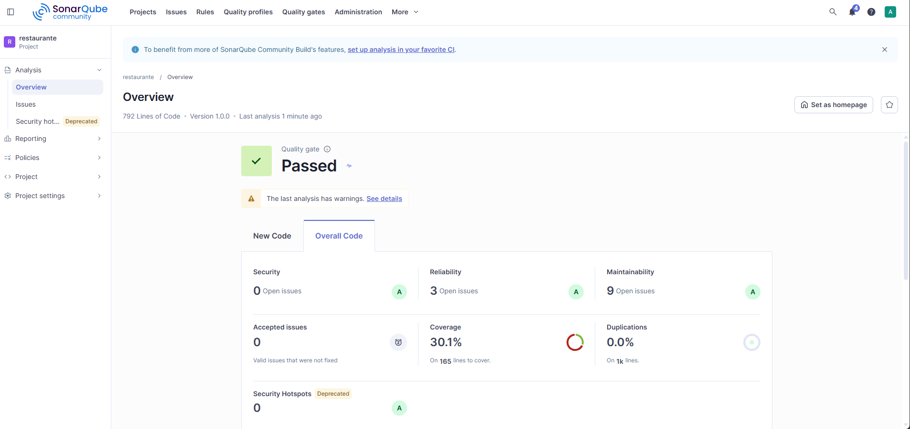
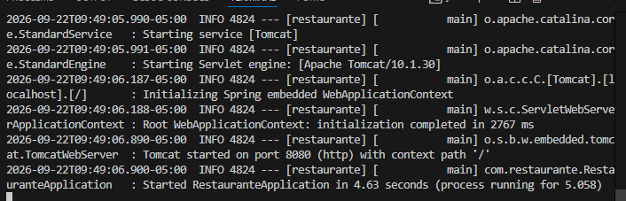
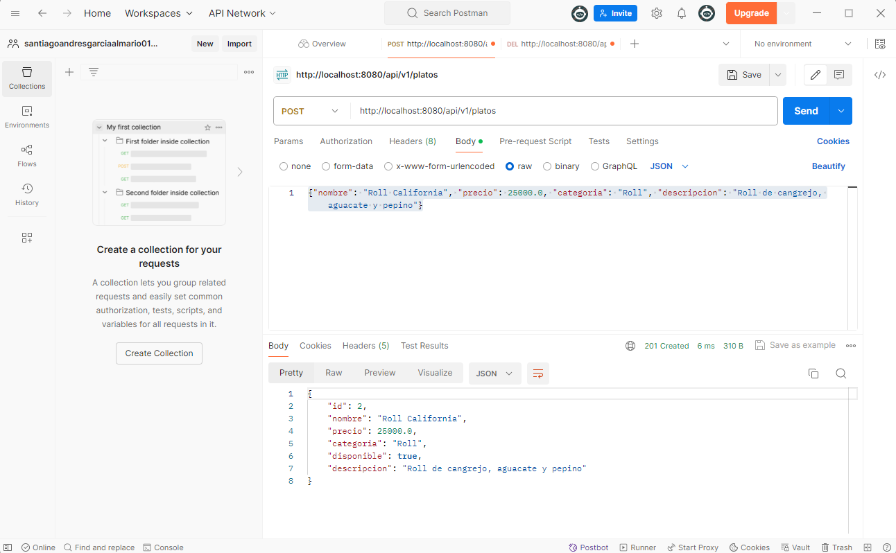
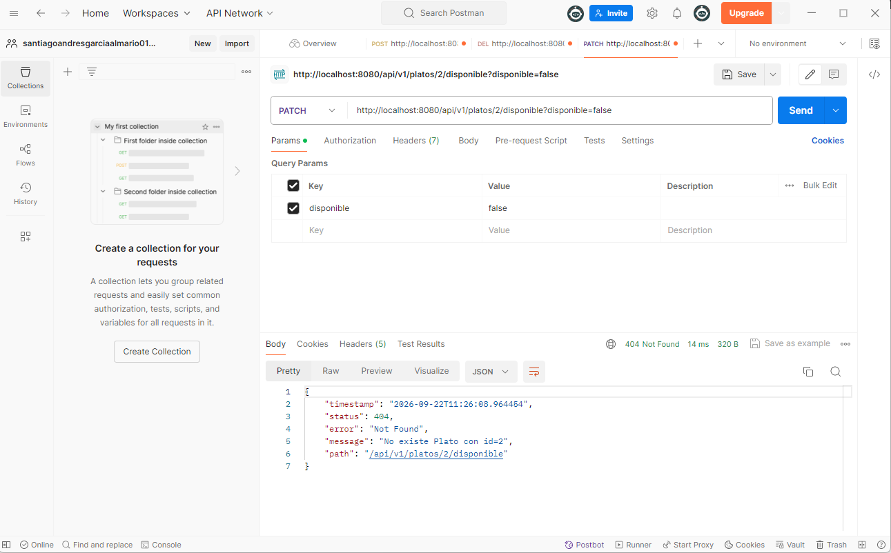
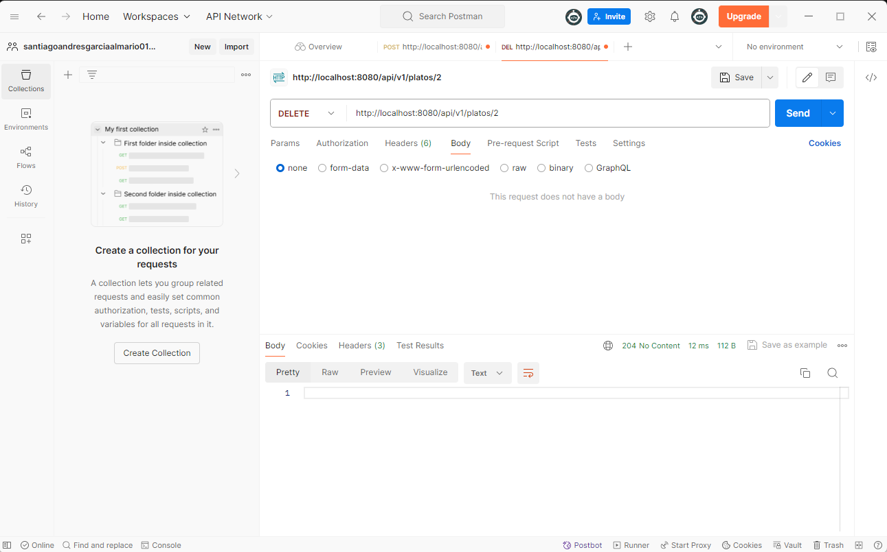

# Bitacora DOSW - Corte 2 - Sushi Craft

**Autor:** Santiago Andres Garcia Almario

## Descripcion

API REST del restaurante **Sushi Craft** (app *Kaze & Nori*), el concepto de
restaurante escogido en el LAB03 de corte 1. Construida siguiendo la Guia
Turtwig (arquitectura por capas: Dominio -> DTO -> Mapper -> Service ->
Controller) y las diapositivas de la Semana 8 de DOSW 1.

**Estado actual: sin persistencia.** Los Services guardan todo en memoria
(`Map`/`AtomicLong`) mientras no se agregue base de datos - asi lo pide
explicitamente la clase.

## Funcionalidades

La API agrupa las funcionalidades en dos vistas sobre el mismo dominio de
platos (ver diapositiva 24 del deck: Menu = lo que ve el cliente, Platos =
lo que administra el gerente):

- **Administracion de platos** (`/api/v1/platos`): CRUD completo para que
  el gerente cree, edite, consulte, active/desactive disponibilidad y
  elimine platos del menu.
- **Menu publico** (`/api/v1/menu`): vista de solo lectura para el
  cliente, que solo muestra los platos disponibles en este momento, con
  filtro opcional por categoria (Roll, Nigiri, Sashimi, Temaki, Entrada,
  Bebida).
- **Manejo de errores uniforme**: cualquier endpoint responde con el mismo
  formato de error (`ErrorResponseDTO`) ante recurso no encontrado,
  datos invalidos o body malformado.

## Diseno interno: CRUD generico

Los Services de este corte ya no manipulan el `Map`/`AtomicLong` directamente
dentro de cada clase concreta. Se extrajo una clase base
`AbstractCrudServiceImpl<T>` (paquete `service.impl`) que centraliza el
almacenamiento en memoria y las operaciones repetidas de cualquier CRUD:
listar, buscar por id, guardar, reemplazar, eliminar y filtrar por un
criterio. Cada servicio concreto (por ahora solo `PlatoServiceImpl`) hereda
de esa clase y solo implementa 4 metodos pequenos (como se obtiene y se
asigna el id de su entidad, como se genera el siguiente id y como se llama
el recurso para los mensajes de error), ademas de las reglas propias de su
dominio (activar/desactivar disponibilidad, copiar campos al actualizar,
etc.). El contrato publico (`IPlatoService`, los controllers, los DTOs y los
codigos de respuesta) no cambio: es el mismo comportamiento visto desde
afuera, solo cambia como esta organizado el codigo por dentro.

## Tabla de endpoints

| Metodo | Ruta | Descripcion | Respuestas |
|---|---|---|---|
| GET | `/api/v1/platos` | Listar todos los platos (disponibles o no) | 200 |
| GET | `/api/v1/platos/{id}` | Obtener un plato por id | 200, 404 |
| POST | `/api/v1/platos` | Crear un plato nuevo (queda disponible por defecto) | 201, 400 |
| PUT | `/api/v1/platos/{id}` | Actualizar un plato existente | 200, 404, 400 |
| PATCH | `/api/v1/platos/{id}/disponible?disponible={true\|false}` | Cambiar la disponibilidad de un plato | 200, 404 |
| DELETE | `/api/v1/platos/{id}` | Eliminar un plato | 204, 404 |
| GET | `/api/v1/menu` | Ver el menu publico (solo platos disponibles) | 200 |
| GET | `/api/v1/menu/categoria/{categoria}` | Ver el menu filtrado por categoria | 200 |

## Como se ejecuta

```
mvn spring-boot:run
```
- API: http://localhost:8080/api/v1/...
- Swagger UI: http://localhost:8080/swagger-ui/index.html

## Pruebas y cobertura

```
mvn test
```
Corre las 14 pruebas unitarias (11 de `PlatoServiceImplTest` + 3 de `PlatoMapperTest`) y genera el
reporte de cobertura de Jacoco en `target/site/jacoco/index.html`
(abrelo en el navegador despues de correr `mvn test`).

## Analisis estatico (SonarQube local)

SonarQube corre localmente en Docker (contenedor `sonarqube`, puerto 9000).

1. En Docker Desktop, inicia el contenedor `sonarqube` (boton Play) y
   espera ~1 minuto a que levante.
2. Abre http://localhost:9000 (usuario/clave que ya tengas configurados).
3. Crea el proyecto (o usa uno existente) y copia su **Project Key**.
4. En **My Account > Security**, genera un **token**.
5. En `pom.xml`, reemplaza `sonar.projectKey` por la key del paso 3.
6. Corre:

```
mvn verify sonar:sonar -Dsonar.token=TU_TOKEN
```

(o exporta `SONAR_TOKEN` como variable de entorno en vez de pasarlo por
linea de comandos). El reporte queda visible en http://localhost:9000
dentro del proyecto.

## Evidencias

> Pega aqui las capturas de pantalla antes de entregar. Guardalas en una
> carpeta `docs/evidencias/` y enlazalas con ``.

### Swagger UI



### Cobertura de pruebas (Jacoco)



Cobertura total del proyecto: 39% (488/803 instrucciones). Los dos paquetes
con pruebas unitarias son `service.impl` (`PlatoServiceImplTest`, 11 casos),
que llega al 84% de cobertura de instrucciones, y `mapper`
(`PlatoMapperTest`, 3 casos), que llega al 94%. El resto de paquetes
(`controller`, `model.domain`, `config`, raiz) no tiene tests propios
todavia: `controller` se prueba indirectamente con Postman (ver evidencias
abajo) y `model.domain` incluye clases de otros conceptos del restaurante
(Mesa, Pedido, Cuenta, Reserva, RegistroVehiculo) que aun no tienen su
service/controller implementado.

### Analisis estatico (SonarQube local)



Quality Gate: **Passed**. Security 0 issues, Reliability 3 issues,
Maintainability 9 issues (todos con calificacion A), 0% de duplicaciones.

### Ejecucion



### Pruebas por funcionalidad (Postman)

Se probaron los 8 endpoints de la tabla, cada uno con al menos un caso
exitoso y un caso de error:

| Endpoint | Caso exitoso | Caso de error |
|---|---|---|
| GET `/platos` | 200, lista completa | - |
| GET `/platos/{id}` | 200, plato encontrado | 404, id inexistente |
| POST `/platos` | 201, plato creado | 400, body invalido/vacio |
| PUT `/platos/{id}` | 200, plato actualizado | 404, id inexistente |
| PATCH `/platos/{id}/disponible` | 200, disponibilidad cambiada | 404, id inexistente |
| DELETE `/platos/{id}` | 204, plato eliminado | 404, id inexistente |
| GET `/menu` | 200, solo platos disponibles | - |
| GET `/menu/categoria/{categoria}` | 200, filtrado por categoria | - |

Capturas representativas (creacion, actualizacion, eliminacion y los
errores 404 al usar un id que ya no existe):







