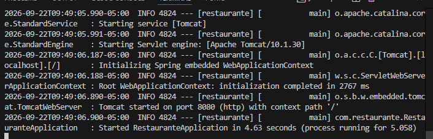
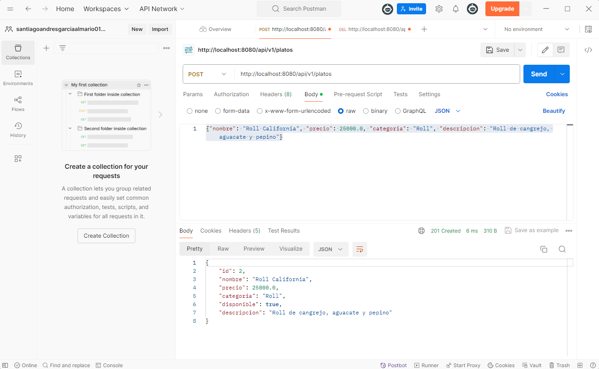
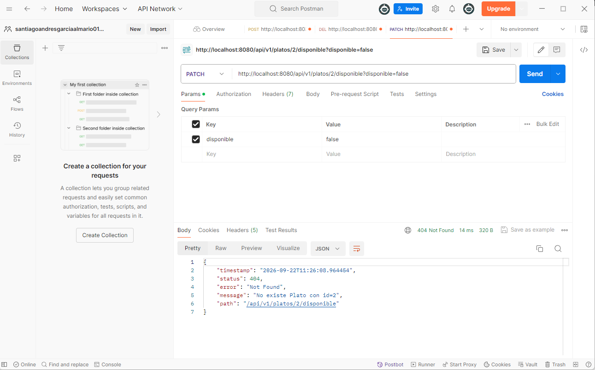
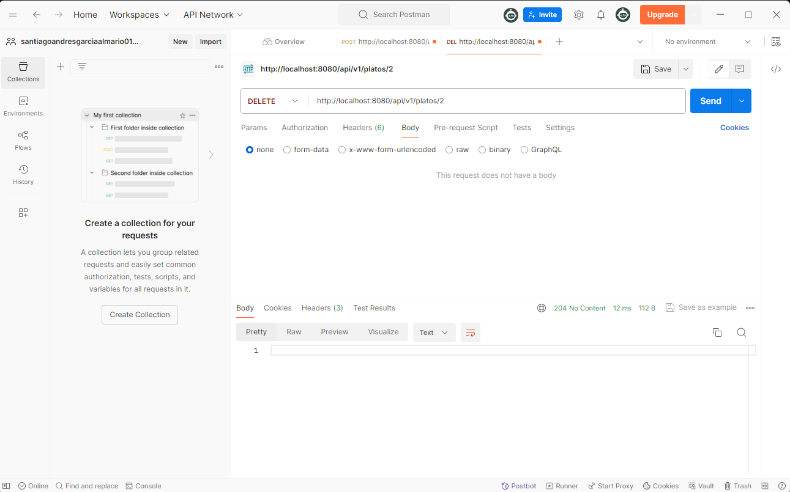

# Bitacora DOSW - Corte 2 - Sushi Craft

**Autor:** Santiago Andres Garcia Almario

**Correo:** santiago.garcia-a@mail.escuelaing.edu.co

## Descripcion

API REST del restaurante **Sushi Craft** (app *Kaze & Nori*), el concepto de
restaurante escogido en el LAB03 de corte 1. Sigue la arquitectura por capas de
la Guia Turtwig (Dominio -> DTO -> Mapper -> Service -> Controller) y en este
corte se le agrego:

- **Persistencia relacional en PostgreSQL** con Spring Data JPA (platos, mesas,
  cuentas, pedidos con sus items, reservas, parqueadero y usuarios).
- **Persistencia NoSQL en MongoDB** para el historial de cambios de cada pedido.
- **Seguridad con Spring Security + JWT**, con permisos por rol
  (GERENTE, MESERO, COCINERO, CLIENTE).
- Los modulos que en la Semana 8 solo tenian clase de dominio (Mesa, Cuenta,
  Pedido, Reserva, RegistroVehiculo) ahora tienen service, controller, DTOs,
  mapper y pruebas.

## Arquitectura

```
controller  ->  DTO (request/response) + Mapper (MapStruct)
    |
service (interfaces I*Service) -> service.impl (reglas de negocio)
    |                                   |
    |                     AbstractCrudServiceImpl<D, E>
    |                                   |
persistence.convertidor (dominio <-> entidad)
persistence.entity + persistence.repository  ->  PostgreSQL
persistence.document + HistorialPedidoRepository -> MongoDB
security (JwtService, filtro JWT, UserDetailsService) + config/SecurityConfig
```

### De CRUD en memoria a CRUD sobre la base de datos

En la Semana 8 extraje la clase `AbstractCrudServiceImpl<T>`, que centralizaba
un `Map` en memoria y las operaciones repetidas de todos los CRUD. En este corte
esa misma clase paso a ser `AbstractCrudServiceImpl<D, E>`:

- `D` es la clase de dominio (ej. `Plato`) y `E` la entidad JPA (ej. `PlatoEntity`).
- En vez de un `Map`, cada servicio concreto le entrega su **repositorio JPA** y
  un **convertidor** (`ConvertidorEntidad<D, E>`).
- Las operaciones que ofrece a las subclases (`listarTodos`, `buscarPorId`,
  `guardar`, `reemplazar`, `eliminarPorId`) son las mismas de antes, asi que los
  servicios siguen concentrados solo en sus reglas de negocio.

El dominio **no tiene anotaciones de JPA**: las entidades viven aparte en
`persistence.entity`, y los convertidores traducen entre ambos mundos. Asi el
modelo del negocio no queda amarrado a la base de datos.

### Por que MongoDB para el historial

El historial de un pedido es un registro de solo-agregar (nunca se edita), no
tiene relaciones con otras tablas y cada evento puede traer un detalle distinto.
Eso encaja mejor con documentos en MongoDB que con una tabla relacional. Cada
vez que un pedido se crea, recibe o pierde un item, cambia de estado o se
elimina, queda un documento en la coleccion `historial_pedidos` con el usuario
que hizo el cambio y la hora.

## Como se ejecuta

Requisitos: Java 17, Maven y Docker Desktop.

```bash
# 1. Levantar PostgreSQL (puerto 5433) y MongoDB (puerto 27018)
docker compose up -d

# 2. Correr la API
mvn spring-boot:run
```

- API: http://localhost:8080/api/v1/...
- Swagger UI: http://localhost:8080/swagger-ui/index.html

Las tablas se crean solas al arrancar (`ddl-auto=update`). La primera vez que la
app corre contra una base vacia, `DatosIniciales` crea un usuario por rol, 6
mesas y 6 platos para poder probar de una vez.

Las credenciales de las bases y la clave JWT se pueden cambiar con variables de
entorno (`DB_URL`, `DB_USER`, `DB_PASSWORD`, `MONGO_URI`, `JWT_SECRET`) sin tocar
`application.properties`.

### Usuarios de prueba

| Rol | Correo | Contrasena |
|---|---|---|
| GERENTE | gerente@kazenori.co | Gerente2026* |
| MESERO | mesero@kazenori.co | Mesero2026* |
| COCINERO | cocina@kazenori.co | Cocina2026* |
| CLIENTE | cliente@kazenori.co | Cliente2026* |

Tambien se puede crear un cliente nuevo con `POST /api/v1/auth/registro`.

### Como usar el token

1. `POST /api/v1/auth/login` con `{"correo": "...", "contrasena": "..."}`.
2. Copiar el campo `token` de la respuesta.
3. En Swagger: boton **Authorize** y pegar el token. En Postman: pestana
   *Authorization* -> *Bearer Token*.

## Seguridad: permisos por rol

| Recurso | Publico | CLIENTE | COCINERO | MESERO | GERENTE |
|---|---|---|---|---|---|
| `/auth/login`, `/auth/registro` | si | si | si | si | si |
| `GET /menu` | si | si | si | si | si |
| `GET /platos` | - | - | si | si | si |
| Crear / editar / eliminar platos | - | - | - | - | si |
| `GET /mesas`, `PATCH /mesas/{id}/estado` | - | - | - | si | si |
| Crear / editar / eliminar mesas | - | - | - | - | si |
| `GET /pedidos`, `PATCH /pedidos/{id}/estado` | - | - | si | si | si |
| Crear pedidos, agregar / retirar items | - | - | - | si | si |
| `DELETE /pedidos/{id}` | - | - | - | - | si |
| Cuentas y parqueadero | - | - | - | si | si |
| Crear / reprogramar / cancelar reservas | - | si | - | si | si |
| `GET /reservas` | - | - | - | si | si |
| `DELETE /reservas/{id}` | - | - | - | - | si |

- Sin token (o con token invalido/vencido) -> **401**.
- Con token valido pero sin el rol necesario -> **403**.
- Ambos salen con el mismo formato `ErrorResponseDTO` que el resto de errores.
- Las contrasenas se guardan con **BCrypt**; el token dura 2 horas.

## Flujo principal (de la llegada del cliente al pago)

1. **Mesero** abre la cuenta de la mesa: `POST /cuentas` `{"idMesa": 3}` -> la mesa pasa a OCUPADA.
2. **Mesero** crea un pedido: `POST /pedidos` `{"idMesa": 3}` -> queda RECIBIDO.
3. **Mesero** agrega platos: `POST /pedidos/{id}/items` `{"idPlato": 1, "cantidad": 2}`.
4. **Cocinero** lo mueve: `PATCH /pedidos/{id}/estado` -> EN_PREPARACION -> LISTO -> ENTREGADO.
5. **Mesero** consulta lo consumido: `GET /cuentas/{id}/consumo`.
6. **Mesero** cierra la cuenta: `PATCH /cuentas/{id}/cerrar` -> se cobra lo ENTREGADO y la mesa vuelve a LIBRE.
7. Cualquiera del personal ve lo que paso: `GET /pedidos/{id}/historial` (MongoDB).

## Reglas de negocio

| Modulo | Regla | Respuesta si se incumple |
|---|---|---|
| Mesas | No hay dos mesas con el mismo numero | 409 |
| Mesas | Una mesa ocupada no se elimina ni cambia de capacidad | 409 |
| Cuentas | Una mesa solo puede tener una cuenta abierta | 409 |
| Cuentas | No se cierra si hay pedidos que no esten ENTREGADOS o CANCELADOS | 422 |
| Pedidos | Solo se pide en mesas con cuenta abierta | 422 |
| Pedidos | Solo se agregan platos disponibles | 422 |
| Pedidos | Solo se modifican en RECIBIDO o EN_PREPARACION | 409 |
| Pedidos | Flujo: RECIBIDO -> EN_PREPARACION -> LISTO -> ENTREGADO; se cancela antes de LISTO | 409 |
| Pedidos | No se manda a cocina un pedido sin items | 422 |
| Pedidos | El item guarda el nombre y el precio del plato al momento de pedirlo | - |
| Reservas | La fecha debe ser futura | 400 / 422 |
| Reservas | La mesa debe alcanzar para el numero de personas | 422 |
| Reservas | Dos reservas de la misma mesa deben estar separadas al menos 2 horas | 409 |
| Parqueadero | La placa se normaliza (abc-123 -> ABC123) y no puede entrar dos veces | 409 |
| Parqueadero | Maximo 15 vehiculos dentro al tiempo | 422 |

## Tabla de endpoints

Todas las rutas empiezan por `/api/v1`.

| Metodo | Ruta | Descripcion |
|---|---|---|
| POST | `/auth/login` | Iniciar sesion y obtener token |
| POST | `/auth/registro` | Registrarse como cliente |
| GET | `/menu` | Menu publico (solo platos disponibles) |
| GET | `/menu/categoria/{categoria}` | Menu filtrado por categoria |
| GET | `/platos` | Listar todos los platos |
| GET | `/platos/{id}` | Obtener un plato |
| POST | `/platos` | Crear plato |
| PUT | `/platos/{id}` | Actualizar plato |
| PATCH | `/platos/{id}/disponible?disponible=` | Activar / desactivar plato |
| DELETE | `/platos/{id}` | Eliminar plato |
| GET | `/mesas?estado=` | Listar mesas (filtro opcional) |
| GET | `/mesas/{id}` | Obtener una mesa |
| POST | `/mesas` | Crear mesa |
| PUT | `/mesas/{id}` | Actualizar numero y capacidad |
| PATCH | `/mesas/{id}/estado` | Cambiar estado de la mesa |
| DELETE | `/mesas/{id}` | Eliminar mesa |
| GET | `/cuentas?estado=` | Listar cuentas |
| GET | `/cuentas/{id}` | Obtener una cuenta |
| GET | `/cuentas/{id}/consumo` | Consumo actual de la cuenta |
| POST | `/cuentas` | Abrir cuenta de una mesa |
| PATCH | `/cuentas/{id}/cerrar` | Cerrar cuenta y liberar mesa |
| GET | `/pedidos?idMesa=&estado=` | Listar pedidos (filtros opcionales) |
| GET | `/pedidos/{id}` | Obtener un pedido con sus items y total |
| POST | `/pedidos` | Crear pedido |
| POST | `/pedidos/{id}/items` | Agregar plato al pedido |
| DELETE | `/pedidos/{id}/items/{idItem}` | Retirar item |
| PATCH | `/pedidos/{id}/estado` | Cambiar estado del pedido |
| GET | `/pedidos/{id}/historial` | Historial del pedido (MongoDB) |
| DELETE | `/pedidos/{id}` | Eliminar pedido |
| GET | `/reservas?proximas=` | Listar reservas |
| GET | `/reservas/{id}` | Obtener una reserva |
| POST | `/reservas` | Crear reserva |
| PATCH | `/reservas/{id}/fecha` | Reprogramar reserva |
| PATCH | `/reservas/{id}/cancelar` | Cancelar reserva |
| DELETE | `/reservas/{id}` | Eliminar reserva |
| GET | `/parqueadero?activos=` | Listar registros |
| GET | `/parqueadero/estado` | Cupos disponibles |
| GET | `/parqueadero/{id}` | Obtener un registro |
| POST | `/parqueadero/entradas` | Registrar entrada |
| PATCH | `/parqueadero/{id}/salida` | Registrar salida |
| DELETE | `/parqueadero/{id}` | Eliminar registro |

## Base de datos

- `docs/sql/esquema.sql`: el esquema de PostgreSQL equivalente a las entidades
  JPA (tablas, llaves, restricciones `CHECK` e indices).
- `docs/sql/consultas-verificacion.sql`: consultas para comprobar que lo que se
  hace por la API queda guardado (totales por pedido, cuentas cerradas vs. lo
  entregado, platos mas pedidos, reservas proximas, vehiculos dentro) y los
  comandos de `mongosh` para ver el historial.

```bash
docker exec -it sushicraft-postgres psql -U sushicraft -d sushicraft_db
docker exec -it sushicraft-mongo mongosh sushicraft_historial
```

## Pruebas y cobertura

```
mvn test
```

Son pruebas unitarias con JUnit 5, Mockito y AssertJ; no necesitan que
PostgreSQL ni MongoDB esten corriendo porque los repositorios se simulan con
mocks. Cubren:

| Clase de prueba | Que verifica |
|---|---|
| `PlatoServiceImplTest` | CRUD de platos sobre el repositorio JPA |
| `MesaServiceImplTest` | Numero unico, mesa ocupada, cambios de estado |
| `CuentaServiceImplTest` | Apertura, consumo, cierre y cobro solo de lo entregado |
| `PedidoServiceImplTest` | Cuenta abierta, platos disponibles, items, flujo de estados, historial |
| `ReservaServiceImplTest` | Fecha futura, capacidad, cruces de horario, cancelar/reprogramar |
| `RegistroVehiculoServiceImplTest` | Placa normalizada, duplicados, cupos, salida |
| `HistorialPedidoServiceImplTest` | Autor del evento (usuario autenticado o "sistema") |
| `AuthServiceImplTest` | Login, credenciales invalidas, registro de clientes |
| `JwtServiceTest` | Token valido, de otro usuario, vencido o con otra firma |
| `EstadoPedidoTest` | Tabla de transiciones permitidas (prueba parametrizada) |
| `ReglasDominioTest` | Metodos de negocio de las clases de dominio |
| `PlatoMapperTest`, `PedidoMapperTest`, `ReservaYParqueaderoMapperTest` | Mapeos de MapStruct |

El reporte de Jacoco queda en `target/site/jacoco/index.html`.

## Analisis estatico (SonarQube local)

SonarQube corre localmente en Docker (contenedor `sonarqube`, puerto 9000).

1. En Docker Desktop, inicia el contenedor `sonarqube` y espera ~1 minuto.
2. Abre http://localhost:9000.
3. Crea el proyecto (o usa uno existente) y copia su **Project Key**.
4. En **My Account > Security**, genera un **token**.
5. En `pom.xml`, reemplaza `sonar.projectKey` por la key del paso 3.
6. Corre:

```
mvn verify sonar:sonar -Dsonar.token=TU_TOKEN
```

## Evidencias

> Capturas guardadas en `docs/evidencias/`.

### Semana 8 (CRUD de platos, sin persistencia)









### Semana 9 (persistencia y seguridad)

> Pendiente: tomar estas capturas con la app corriendo y guardarlas con estos
> nombres en `docs/evidencias/`.

| Evidencia | Archivo |
|---|---|
| Contenedores de PostgreSQL y MongoDB corriendo | `docker-contenedores.png` |
| Swagger con el boton Authorize | `swagger-authorize.png` |
| Login exitoso (200 con token) | `auth-login-200.png` |
| Peticion sin token (401) | `auth-sin-token-401.png` |
| Cocinero intentando crear un plato (403) | `auth-rol-403.png` |
| Flujo completo: abrir cuenta, pedido, items, estados, cerrar | `flujo-cuenta-pedido.png` |
| Regla de negocio (ej. cerrar cuenta con pedidos pendientes, 422) | `regla-negocio-422.png` |
| Datos en PostgreSQL (consulta 4 de `consultas-verificacion.sql`) | `postgres-pedidos.png` |
| Datos siguen despues de reiniciar la app | `persistencia-reinicio.png` |
| Historial del pedido en MongoDB | `mongo-historial.png` |
| Cobertura Jacoco | `jacoco-cobertura.png` |
| SonarQube | `sonar-overview.png` |
